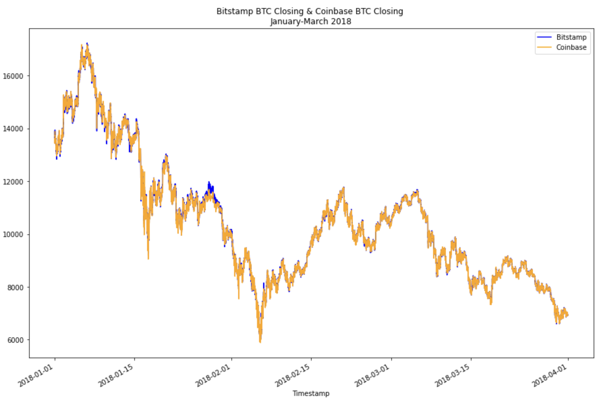

# Crypto Arbitrage 2018

Looking at data from **Bitstamp and Coinbase between January and March in 2018**, the jupyter notebook compares Bitcoin prices to find profit from arbitrage.

---

## Technologies

Python version 3.9 
* [Jupyter Notebook](https://jupyter.org/) - Interactive computing with python
* [pandas](https://pandas.pydata.org/) - To read, calculate, analysis, visualize data
* [pathlib](https://docs.python.org/3/library/pathlib.html) - Dynamic path finder
* [matplotlib](https://matplotlib.org/) - To visualize the data

---

## Installation Guide

To install the dependencies used for this application, enter the followinf into your terminal.
```python
pip install pandas
pip install pathlib
pip install matplotlib
```

---

## Usage 

The notebook illistrates information for both Bitstamp and Coinbase from January to March in 2018. The illistaration below are the closing prices of BTC of both Bitstamp and Coinbase


---

## Contributors

Main contributer **Santiago Hernandez**
- [dsmannight@gmail.com](dsmannight@gmail.com)

---

## License

This application is free for non-profit use.
